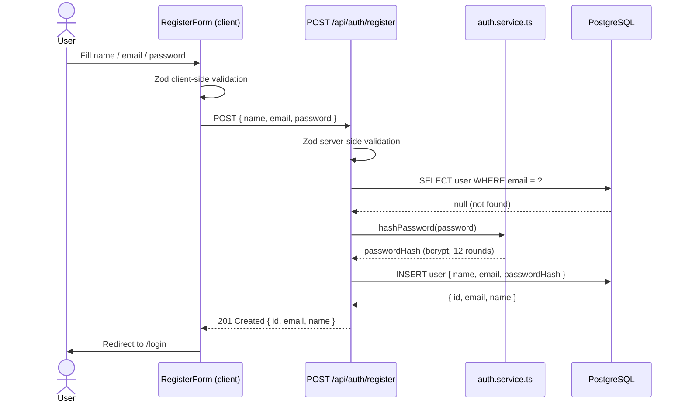
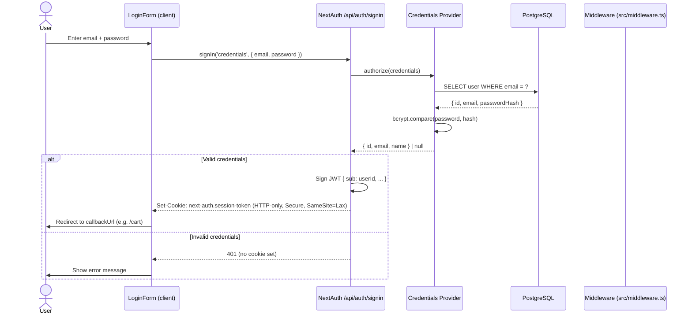
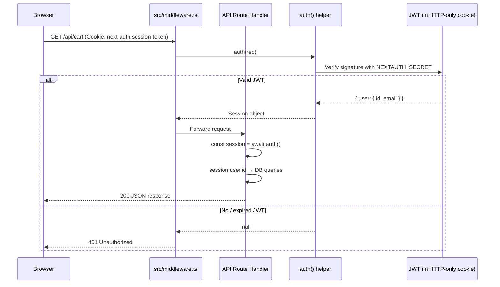
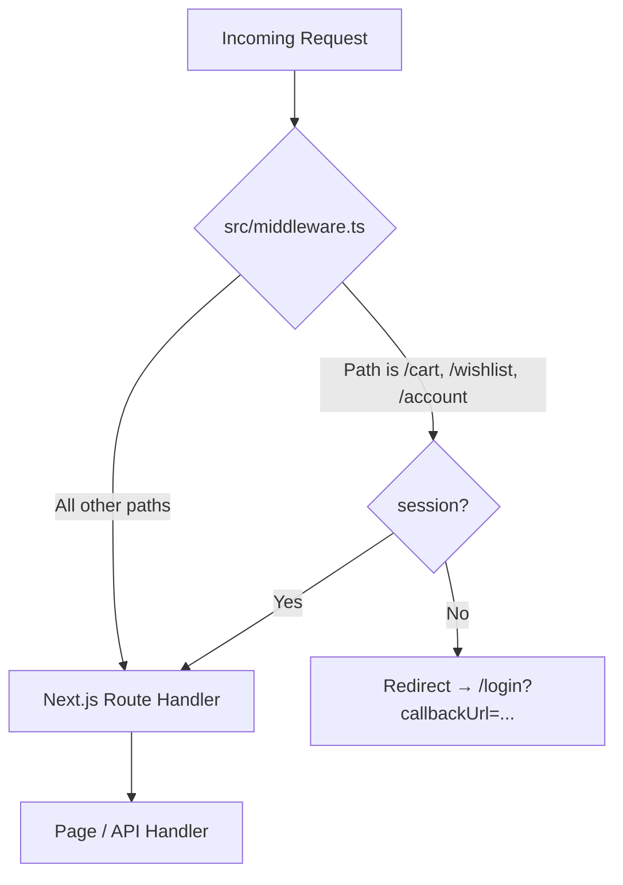
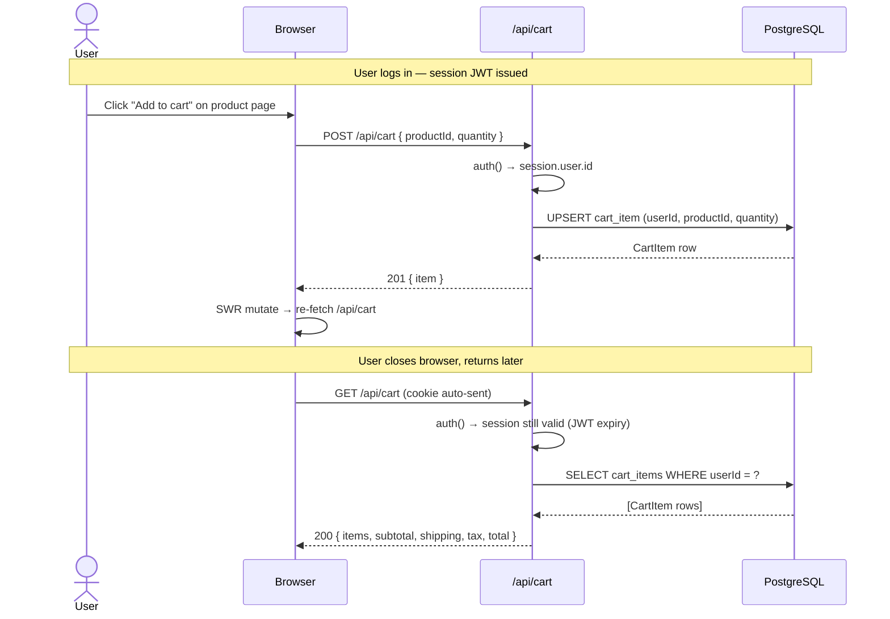
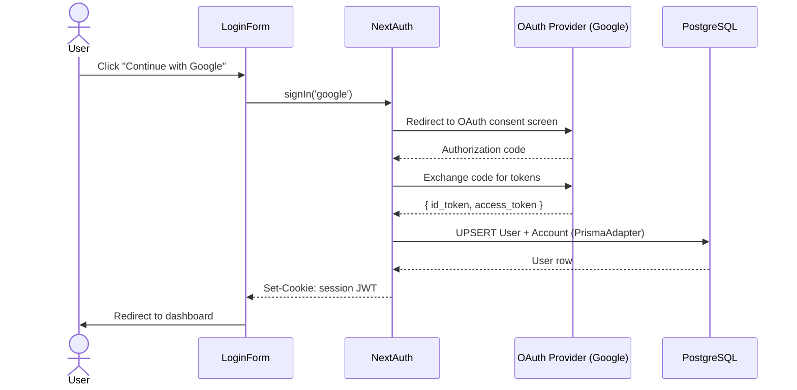

# Auth & Session Flow Diagrams

Diagrams use [Mermaid](https://mermaid.js.org/) syntax.
Render in VS Code with the *Markdown Preview Mermaid Support* extension,
or paste into https://mermaid.live.

---

## 1. Registration Flow

---

## 2. Login Flow (Credentials)

---

## 3. Session Verification Flow (Protected API Route)

---

## 4. Page-Level Route Protection (Middleware)

---

## 5. Cart Persistence (Cross-Session)

---

## 6. OAuth (Google / Apple) — Future

